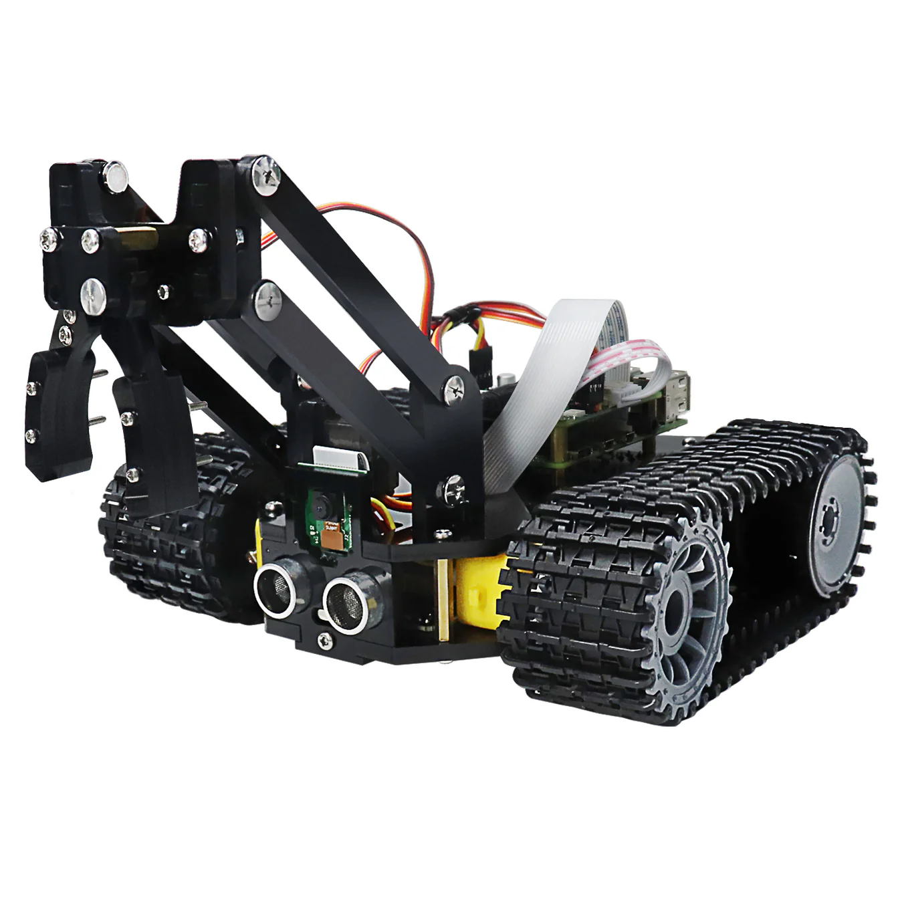

# Tank Robot – Predictive Indoor Navigation
A predictive indoor navigation system for the **Freenove Tank Robot Kit for
Raspberry Pi (FNK0077)** that uses **V-JEPA 2** as a world model to anticipate
future obstacles — not just react to what is currently visible.
<p align="center">
  
</p>
---

## What

- Predictive indoor navigation for the **Freenove FNK0077** tank robot.
- **Split-inference** architecture: the Pi is a thin client that only streams
  camera frames + ultrasonic distance; **all AI runs on the PC** — YOLO11n +
  V-JEPA 2 + SSv2 + Depth-Anything V2.
- **Multi-layer safety**, each layer only ever making the robot *more* cautious:
  ultrasonic hard-stop → vision reroute → kinematic speed governor → depth
  free-space.
- Operator UI viewers (browser Streamlit, native pywebview window, PyQt5) show
  live annotated video, risk bars and AI state; AUTO (AI drives) / MANUAL modes.

## Why

- **V-JEPA 2 anticipates** obstacles instead of only reacting — it begins
  decelerating frames before a YOLO-only baseline would.
- **Depth gives class-agnostic geometry** — it sees walls YOLO has no class for,
  and yields a real REROUTE direction (which side is open).
- **SSv2 reads behaviour** — a real Something-Something-V2 video model classifies
  what the obstacle is *doing* and fills in YOLO's object (e.g. *"person moving
  closer"*), giving the operator and logs a human-readable read of the scene
  (annotation only — it does not drive control).
- **The latency-aware governor** reserves braking room for the AI's decision
  time, so the robot never outruns its own perception (e.g. slow V-JEPA 2 on CPU).
- **The thin-client Pi stays lightweight** — no torch/ultralytics on the robot.

## How

Fastest path — demo in Docker on Mac / Linux (no robot needed):

```bash
# Build the server image (arm64 Mac Apple Silicon + amd64 Linux both work)
docker build -f Dockerfile.server -t nav-server .

# Demo mode — supply a corridor video first:
#   mkdir -p assets/demo_clips && cp /path/to/corridor.mp4 assets/demo_clips/
docker run --rm -p 5003:5003 -p 8003:8003 -p 5004:5004 -p 8004:8004 -p 8501:8501 -v "$(pwd)/assets:/app/assets:ro" -v "$(pwd)/logs_rpi:/app/logs_rpi" nav-server
# Then open http://localhost:8501 → enter "localhost" as server IP → Connect
```

Live mode on an **AMD GPU (ROCm)** — the full server command with a real robot:

```bash
# Build the ROCm image (use the wheel index matching your ROCm; see HOW_TO_RUN.md):
docker build --build-arg TORCH_INDEX=https://download.pytorch.org/whl/rocm6.3 \
             -f Dockerfile.server -t nav-server-rocm .

docker run --rm \
  --device=/dev/kfd --device=/dev/dri --group-add video \
  --security-opt seccomp=unconfined \
  -e NAV_MODE=live \
  -e TORCH_ROCM_AOTRITON_ENABLE_EXPERIMENTAL=1 \
  -v hf-cache:/root/.cache/huggingface \
  -p 5003:5003 -p 8003:8003 -p 5004:5004 -p 8004:8004 -p 8501:8501 \
  nav-server-rocm
```

- `-e NAV_MODE=live` — wait for the robot (the default *demo* mode needs a bundled video).
- `-e TORCH_ROCM_AOTRITON_ENABLE_EXPERIMENTAL=1` — enables the memory-efficient SDPA
  kernels so V-JEPA 2 doesn't OOM on the Radeon (baked into the image; explicit here for
  older images). If AOTriton isn't available for your card it falls back to CPU, not a crash.
- `-v hf-cache:…` — weights download once instead of every `--rm` run.

For the Raspberry Pi robot command, the native venv path, NVIDIA/CUDA, and every
flag explained, see **[HOW_TO_RUN.md](HOW_TO_RUN.md)**.

## First-run checklist

1. **Install/build** — server deps in a venv on the PC (`pip install -r requirements_server.txt`); build the robot image on the Pi. → [HOW_TO_RUN.md](HOW_TO_RUN.md)
2. **Smoke-test in demo mode** (no robot): run the server `--mode demo`, open the UI, confirm annotated video + risk/action HUD. → [HOW_TO_RUN.md](HOW_TO_RUN.md)
3. **Go live**: start the server (natively on a Mac for MPS), start the Pi client (`docker compose -f docker-compose.robot.yml up --build`), confirm the UI shows live video and a *changing* ultrasonic value. → [HOW_TO_RUN.md](HOW_TO_RUN.md)
4. **Calibrate** (in order: V-JEPA 2 anchors → depth scale → speed governor). Anchors are the biggest quality win; depth scale + governor make the absolute distances/speeds real. Full step-by-step in **[CALIBRATION.md](CALIBRATION.md)**.
5. **Verify**: `V-JEPA 2` reads `BLOCKED`/`CLEAR` (not stuck on `MIXED`), the HUD `Depth: <d>m` matches a tape measure, and the robot slows early, stops before walls, and reroutes toward the open side.

## Documentation

- **[ARCHITECTURE.md](ARCHITECTURE.md)** — design, AI models, TCP protocol, safety layers, project structure.
- **[HOW_TO_RUN.md](HOW_TO_RUN.md)** — setup, run modes (demo/live/Docker), UI viewers, config tables, tests, logging.
- **[CALIBRATION.md](CALIBRATION.md)** — detailed step-by-step for the three calibrations (V-JEPA 2 anchors, depth scale, speed governor) with verification + troubleshooting.
- **[TROUBLESHOOTING.md](TROUBLESHOOTING.md)** — camera / GPIO / compose / brownout gotchas and the rebuild-after-pull trap.
- `CLAUDE.md` — development guide for AI assistants working in this repo.

## Success criteria

- **Obstacle Avoidance** — the robot slows early, stops before walls/obstacles, and
  reroutes toward the more-open side. It never depends on one sensor: the ultrasonic
  **hard-stop** halts it even when vision misses (e.g. a bare wall), and the kinematic
  **speed governor** caps speed so it can always stop within the measured clear distance.
- **Goal Following** — given a goal clicked on the video, the robot steers toward it
  (turns in place when off-bearing, drives forward when aligned) and stops on arrival
  (`reached`); the avoidance stack always overrides steering.
- **Closed-loop avoidance** — on a persistent obstacle it picks a context-appropriate
  maneuver (WAIT for a crossing / person, TURN toward the open side until it clears,
  BACK UP when too close) instead of freezing, with guards against endless spin/backup.
- **Predictive advantage** — predictive mode visibly begins decelerating **earlier**
  than baseline, the V-JEPA 2 label reads `BLOCKED` (with calibrated anchors) before the
  YOLO11 detector fills the risk bar, and motion is smoother (fewer cold-start full stops).
- **Calibrated distances** — after calibration the HUD `Depth: <d> m` matches a tape
  measure and the governor uses real SI speeds (see [CALIBRATION.md](CALIBRATION.md)).
- **Stable & observable** — the pipeline runs stably at interactive frame rates (tens of
  FPS on a GPU/MPS box; reduced on CPU, where the SSv2 cadence is throttled), the operator
  UI stays responsive with a live 2D navigation map, and every frame's signals are logged
  to CSV for offline analysis and visualization (`run_visualizer.py`).
